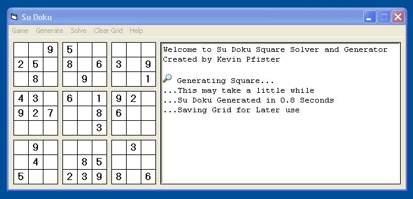



## Su Doku Generator and Solver

### Description

This is a must have for all Su Doku Fans! This program I have created that can Generate the Play Grids, usually in around 5 seconds or preload an already made grid. If you get stuck trying to complete a grid the program can give hints and check if the grid is Valid, though if all else fails the program can solve all Logical Su Doku Puzzles for you. Loaded with this program is 50 premade grids for you to play through. Sorry for the 'sloppy' code, was in a hurry to make this; will update it soon. And as always it runs hugely faster when compiled!!!
 
### More Info
 

             |
---                |---
**Submitted On**   |2005-07-11 19:34:30
**By**             |[Kevin Pfister](https://github.com/Planet-Source-Code/PSCIndex/blob/master/ByAuthor/kevin-pfister.md)
**Level**          |Intermediate
**User Rating**    |4.5 (18 globes from 4 users)
**Compatibility**  |VB 6\.0
**Category**       |[Games](https://github.com/Planet-Source-Code/PSCIndex/blob/master/ByCategory/games__1-38.md)
**World**          |[Visual Basic](https://github.com/Planet-Source-Code/PSCIndex/blob/master/ByWorld/visual-basic.md)
**Archive File**   |[Su\_Doku\_Ge1912067112005\.zip](https://github.com/Planet-Source-Code/kevin-pfister-su-doku-generator-and-solver__1-61645/archive/master.zip)

